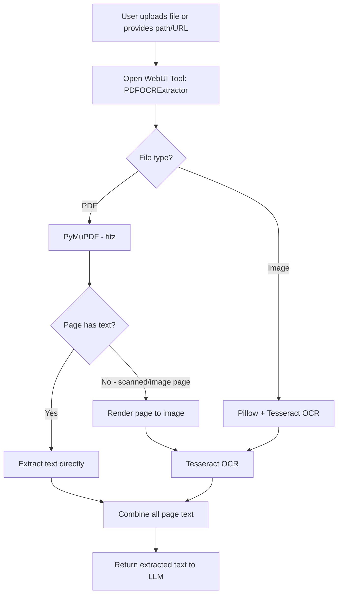
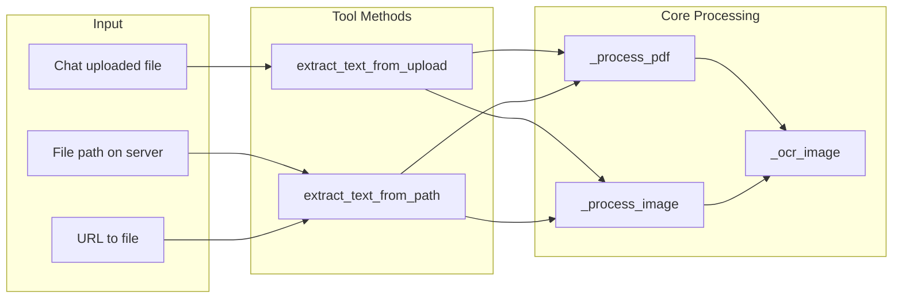

# Open WebUI PDF & OCR Text Extraction Tool — Architecture Plan

## Overview

Build an Open WebUI **Tool** (Python plugin) that enables LLM models to extract text from PDFs and images using **Tesseract OCR** — fully offline, with multi-language support (English + Swedish).

## Requirements

| Requirement | Detail |
|---|---|
| Deployment | Docker (Open WebUI container) |
| OCR Engine | Tesseract (fully offline) |
| File Sources | Chat-uploaded files + file path/URL parameter |
| File Types | PDF, PNG, JPG, JPEG, TIFF, BMP, GIF, WEBP |
| Languages | English (`eng`) + Swedish (`swe`), configurable via Valves |
| PDF Handling | Text-based PDFs: direct extraction; Scanned/image PDFs: render to image → OCR |

## Architecture

### Component Diagram



### Processing Flow



## Tool Class Design

### Class: `Tools`

```
Tools
├── Valves (Pydantic BaseModel)
│   ├── ocr_languages: str = "eng+swe"
│   ├── text_threshold: int = 50
│   ├── dpi: int = 300
│   ├── max_pages: int = 250
│   └── output_format: str = "markdown"
│
├── __init__()
│
├── extract_text_from_upload()      ← Tool method: processes chat-uploaded files
│   params: file_id: str
│   special: __event_emitter__, __user__
│
├── extract_text_from_path()        ← Tool method: processes file by path or URL
│   params: file_path: str
│   special: __event_emitter__
│
├── _process_pdf()                  ← Internal: handles PDF files
│   - Extracts text with PyMuPDF
│   - Detects image-only pages via text_threshold
│   - Renders image-only pages and runs OCR
│
├── _process_image()                ← Internal: handles image files
│   - Opens image with Pillow
│   - Runs Tesseract OCR
│
└── _ocr_image()                    ← Internal: runs Tesseract on a PIL Image
    - Calls pytesseract.image_to_string()
    - Uses configured languages
```

### Valves Configuration

| Valve | Type | Default | Description |
|---|---|---|---|
| `ocr_languages` | `str` | `"eng+swe"` | Tesseract language codes, `+` separated |
| `text_threshold` | `int` | `50` | Min characters per page to consider it text-based; below this triggers OCR |
| `dpi` | `int` | `300` | DPI for rendering PDF pages to images for OCR |
| `max_pages` | `int` | `250` | Maximum number of PDF pages to process; 0 = unlimited |
| `output_format` | `str` | `"markdown"` | Output format: `"text"`, `"markdown"`, `"save_txt"`, `"save_md"` |

## Output Format

The tool supports multiple output formats, configurable via the `output_format` Valve:

| Format | Behavior |
|---|---|
| `"text"` | Returns plain text with simple `--- Page N ---` separators. Lightweight, good for LLM consumption. |
| `"markdown"` | Returns markdown with `## Page N` headers and code fences for OCR'd content. Default — best for readability. |
| `"save_txt"` | Returns text to LLM AND saves a `.txt` file to the server. Useful for archiving. |
| `"save_md"` | Returns markdown to LLM AND saves a `.md` file to the server. Useful for archiving. |

**Note:** In all cases, the extracted text is always returned to the LLM as a string. The `save_*` options additionally persist the output as a file. `.docx` export is intentionally excluded to avoid adding the `python-docx` dependency — if needed, the LLM can be asked to format the output and the user can copy it.

## Dependencies

### Python Packages (pip)

| Package | Purpose |
|---|---|
| `PyMuPDF` (fitz) | PDF text extraction + page-to-image rendering |
| `pytesseract` | Python wrapper for Tesseract OCR |
| `Pillow` | Image processing |
| `pydantic` | Valves configuration (already in Open WebUI) |
| `httpx` or `requests` | Download files from URLs (already in Open WebUI) |

### System Packages (apt)

| Package | Purpose |
|---|---|
| `tesseract-ocr` | OCR engine |
| `tesseract-ocr-swe` | Swedish language data |
| `tesseract-ocr-eng` | English language data (usually included by default) |

## Docker Setup

Since Open WebUI runs in Docker, Tesseract and its language packs need to be installed in the container. There are two approaches:

### Option A: Custom Dockerfile (Recommended)

Extend the official Open WebUI image:

```dockerfile
FROM ghcr.io/open-webui/open-webui:main

# Install Tesseract OCR and language packs
RUN apt-get update && apt-get install -y \
    tesseract-ocr \
    tesseract-ocr-eng \
    tesseract-ocr-swe \
    && rm -rf /var/lib/apt/lists/*

# Install Python dependencies
RUN pip install --no-cache-dir PyMuPDF pytesseract Pillow
```

### Option B: Runtime Installation (Quick but not persistent)

Exec into the running container and install:

```bash
docker exec -it open-webui bash
apt-get update && apt-get install -y tesseract-ocr tesseract-ocr-swe
pip install PyMuPDF pytesseract Pillow
```

> **Note:** Option B is lost on container restart. Option A is recommended for production.

## File Handling Strategy

### Chat-Uploaded Files

Open WebUI stores uploaded files on the server. The tool accesses them via:
1. The `__user__` context which may contain file references
2. The Open WebUI internal file API to get the file path
3. Reading the file from the server filesystem

### Path/URL Files

The tool accepts:
- **Absolute server paths**: e.g., `/app/backend/data/uploads/myfile.pdf`
- **HTTP/HTTPS URLs**: Downloads the file to a temp location, processes it, then cleans up

## Error Handling

| Scenario | Handling |
|---|---|
| Tesseract not installed | Return clear error message with installation instructions |
| Unsupported file type | Return error listing supported types |
| Corrupted PDF | Catch exception, return partial results if possible |
| File not found | Return descriptive error with the path attempted |
| OCR produces empty text | Return warning that the page may be blank or unreadable |
| Page limit exceeded | Process up to `max_pages`, warn about truncation |

## Event Emitter Usage

The tool will emit status events to keep the user informed:

1. `"Starting text extraction..."` — when processing begins
2. `"Processing page X of Y..."` — per-page progress for PDFs
3. `"Running OCR on page X (scanned/image page)..."` — when OCR is triggered
4. `"Extraction complete! Processed X pages, Y via OCR."` — final status

## Deliverables

1. **`pdf_ocr_tool.py`** — The Open WebUI Tool file (single Python file to paste into Open WebUI Tools UI)
2. **`Dockerfile`** — Custom Dockerfile extending Open WebUI with Tesseract + dependencies
3. **`README.md`** — Setup and usage instructions

## Installation Steps

1. Build custom Docker image with Tesseract and Python dependencies
2. Deploy/restart Open WebUI with the new image
3. Go to Open WebUI → Workspace → Tools → Create New Tool
4. Paste the tool code
5. Configure Valves (OCR languages, DPI, etc.)
6. Enable the tool for your models
7. Test with a PDF and an image

## Usage Examples

Once installed, users can:

- **Upload a PDF** to the chat and ask: *"Extract all text from this PDF"*
- **Upload a scanned document image** and ask: *"OCR this image and give me the text"*
- **Provide a file path**: *"Extract text from /data/reports/quarterly.pdf"*
- The LLM will call the appropriate tool method and receive the extracted text as context
